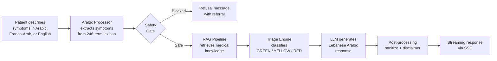

<div align="center">

# حكيم — Hakim

**AI-Powered Medical Triage for Arabic Speakers**

[](https://github.com/YOUR_USERNAME/hakim/actions/workflows/ci.yml)
[](https://github.com/YOUR_USERNAME/hakim/actions/workflows/deploy.yml)
[](LICENSE)

Hakim takes symptom descriptions in **Lebanese Arabic**, **Franco-Arab** (3ammiye), or **English**, triages urgency into GREEN / YELLOW / RED, suggests possible conditions with medical citations, and recommends next steps — all with strict safety guardrails.

[Live Demo](https://frontend-opal-one-46.vercel.app) · [API Docs](docs/API.md) · [Architecture](docs/ARCHITECTURE.md) · [Safety](docs/SAFETY.md)

</div>

---

## The Problem

Millions of Arabic speakers — especially in Lebanon — lack quick access to reliable medical guidance in their own dialect. Existing symptom checkers are English-only, use formal medical language, and don't understand Lebanese colloquial ("عندي وجع راس" or "3endi waja3 ras"). Hakim bridges this gap with a triage assistant that speaks like a trusted friend from Beirut.

## How It Works



### Triage Levels

| Level | Meaning | Example |
|-------|---------|---------|
| **GREEN** | Self-care at home | Common cold, mild headache |
| **YELLOW** | See a doctor within 24-48h | Persistent fever, ear pain |
| **RED** | Emergency — go to ER now | Chest pain + arm numbness, difficulty breathing |

## Tech Stack

| Layer | Technology | Why |
|-------|-----------|-----|
| **Backend** | FastAPI + Python 3.11 | Async-first, native SSE streaming, type-safe |
| **Frontend** | React 19 + TypeScript + Tailwind CSS v4 | Modern, fast, RTL-ready |
| **LLM** | Gemini 2.5 Flash (primary), Groq Llama 3.3 70B (fallback) | Free tier, low latency, Arabic support |
| **Embeddings** | Gemini text-embedding-004 (768d) | Best Arabic embedding quality on free tier |
| **Vector DB** | ChromaDB | Local, zero-config, hybrid search |
| **Observability** | Langfuse | Open-source LLM tracing, cost tracking |
| **Hosting** | Vercel (frontend) + Render (backend) | Free tier, auto-deploy from GitHub |
| **CI/CD** | GitHub Actions | Lint, test, eval pipeline, deploy on merge |

## Quick Start

### Prerequisites

- Python 3.11+
- Node.js 20+
- Gemini API key ([free](https://aistudio.google.com/apikey))
- (Optional) Groq API key, Docker

### Backend

```bash
cd backend
pip install -e ".[dev]"
cp ../.env.example ../.env   # fill in GEMINI_API_KEY at minimum
uvicorn app.main:app --reload --port 8000
```

Health check: http://localhost:8000/health
API docs: http://localhost:8000/docs

### Frontend

```bash
cd frontend
npm install
echo "VITE_API_URL=http://localhost:8000" > .env
npm run dev
```

App: http://localhost:3000

### Docker

```bash
cp .env.example .env   # fill in API keys
docker compose up
```

### Environment Variables

| Variable | Required | Description |
|----------|----------|-------------|
| `GEMINI_API_KEY` | Yes | Google Gemini API key |
| `GROQ_API_KEY` | No | Groq fallback API key |
| `LANGFUSE_PUBLIC_KEY` | No | Langfuse observability |
| `LANGFUSE_SECRET_KEY` | No | Langfuse observability |
| `LANGFUSE_HOST` | No | Default: `https://us.cloud.langfuse.com` |
| `ALLOWED_ORIGINS` | No | CORS origins, comma-separated |

## Project Structure

```
hakim/
├── .github/workflows/     CI/CD pipelines
│   ├── ci.yml             Lint + test + eval + build
│   └── deploy.yml         Auto-deploy on merge to main
├── backend/
│   ├── app/
│   │   ├── main.py                FastAPI app + middleware
│   │   ├── config.py              Settings from .env
│   │   ├── api/
│   │   │   ├── routes/            chat, triage, health endpoints
│   │   │   ├── middleware/        Rate limiter, CORS
│   │   │   └── dependencies.py   Dependency injection
│   │   ├── core/
│   │   │   ├── arabic_processor   Lebanese dialect NLP (246 terms)
│   │   │   ├── triage_engine      5-step triage pipeline
│   │   │   ├── safety_guardrails  Pre/post-LLM safety filters
│   │   │   ├── llm_client         Gemini + Groq with cache/retry
│   │   │   └── rag_pipeline       Multi-query retrieval + reranking
│   │   ├── knowledge/             Ingest, embed, vector store
│   │   └── data/lexicon/          Lebanese medical term dictionaries
│   └── tests/
│       └── eval/                  55 scenarios, eval pipeline
├── frontend/
│   └── src/
│       ├── components/            13 React components
│       ├── hooks/                 useChat (SSE), useTriage
│       ├── context/               Theme + Language (AR/EN)
│       └── api/                   HTTP client with retry
├── docs/                          Architecture, API, Safety, Eval
├── render.yaml                    Render deployment config
└── docker-compose.yml             Local development
```

## Safety

Hakim is **not** a diagnostic tool. It provides triage guidance only.

**Hard rules (never bypassed):**
- Never provides a diagnosis — always says "possible conditions"
- Never recommends specific medications or dosages
- Detects emergencies via compound symptom patterns (chest pain + arm numbness)
- Refuses to triage infants < 2 years, pregnancy complications, lab results
- Auto-injects disclaimers on every response

See [docs/SAFETY.md](docs/SAFETY.md) for the complete safety philosophy.

## Evaluation

The evaluation pipeline tests 55 scenarios across GREEN, YELLOW, RED, and edge cases:

| Metric | Target | Description |
|--------|--------|-------------|
| Emergency Recall | >= 95% | Must catch RED emergencies |
| False Alarm Rate | <= 10% | GREEN incorrectly escalated to RED |
| Triage Accuracy | Tracked | Overall correct classification |
| Response Quality | 1-5 scale | LLM-judged relevance, empathy, safety |

```bash
cd backend
python -m tests.eval.run_eval --skip-quality --output eval_results.md
```

See [docs/EVALUATION.md](docs/EVALUATION.md) for methodology and results.

## Roadmap

- [x] Phase 1: Foundation & Arabic NLP — Lebanese dialect processor, 246-term lexicon
- [x] Phase 2: Knowledge Base & RAG Pipeline — ChromaDB, multi-query retrieval, reranking
- [x] Phase 3: Triage Engine & Safety — 5-step pipeline, compound emergency detection
- [x] Phase 4: Full-Stack Application — React chat UI, SSE streaming, RTL/i18n
- [x] Phase 5: Evaluation & Testing — 55 scenarios, CI pipeline with 95% recall gate
- [x] Phase 6: Deployment & Polish — Vercel + Render, GitHub Actions CI/CD

### Future

- [ ] Voice input (speech-to-text for Arabic)
- [ ] Multi-turn follow-up questions
- [ ] Expanded lexicon (Gulf, Egyptian, Moroccan dialects)
- [ ] PDF medical report upload and analysis
- [ ] Mobile app (React Native)

## Contributing

See [docs/CONTRIBUTING.md](docs/CONTRIBUTING.md) for guidelines.

## License

[MIT](LICENSE) — free to use, modify, and distribute.

---

<div align="center">

**Built with care for Arabic-speaking communities.**

حكيم — because everyone deserves health guidance in their own language.

</div>
