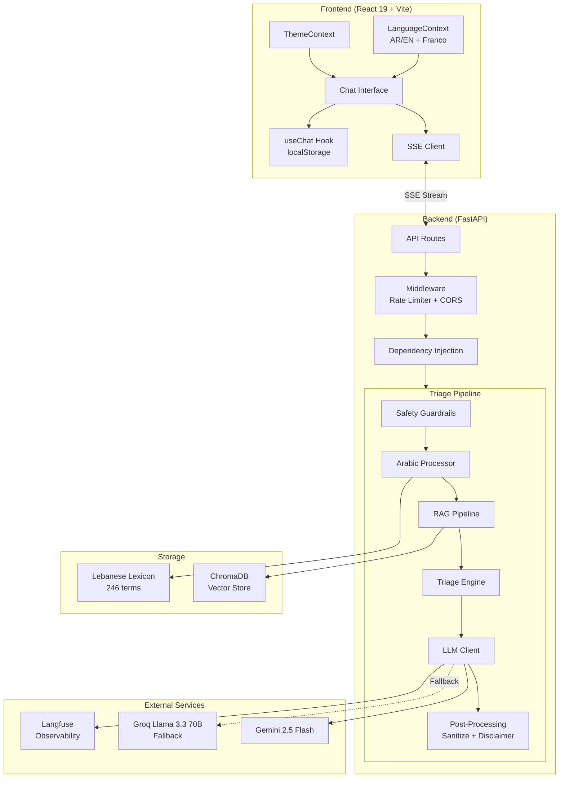
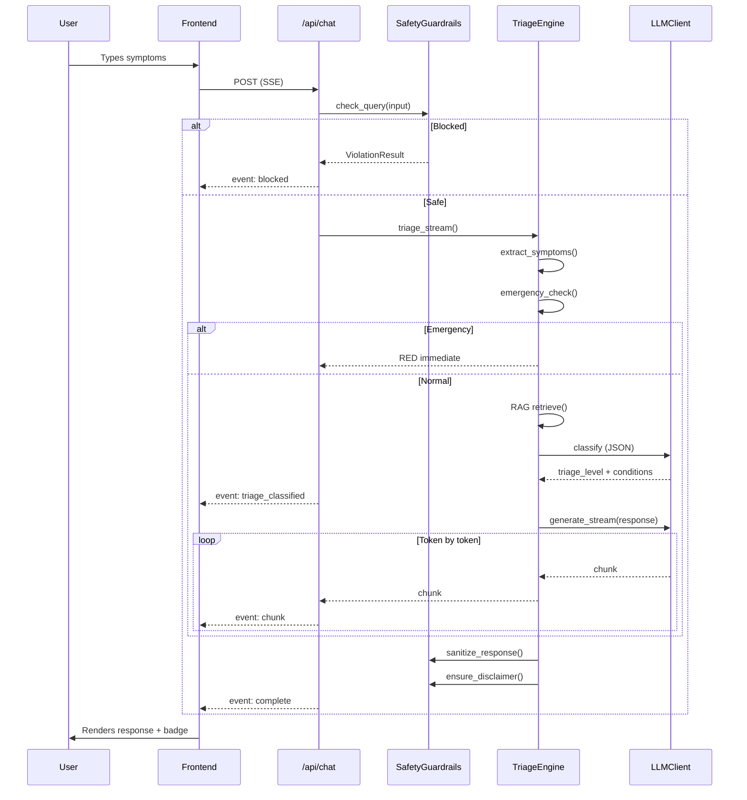

# Architecture

## System Overview

Hakim is a medical triage assistant with a FastAPI backend and React frontend. The backend runs a 5-step triage pipeline that processes Arabic (Lebanese dialect), Franco-Arab, and English symptom descriptions through safety checks, symptom extraction, knowledge retrieval, LLM classification, and response generation — all streamed to the frontend via Server-Sent Events.



## Data Flow

### Chat Endpoint (Streaming)



### Triage Pipeline (5 Steps)

```
Step 1: Symptom Extraction
   Input text -> ArabicProcessor.extract_symptoms()
   - Normalize Arabic (remove diacritics, canonical forms)
   - Scan 1/2/3-grams against 246-term lexicon
   - Match on Arabic script OR Franco-Arab Latin
   - Output: list[LexiconMatch] with body_system, severity_hint

Step 2: Safety Gate
   - Check for scope violations (infant, pregnancy, labs)
   - Check for suicidal ideation patterns
   - If blocked -> return YELLOW with referral message

Step 3: Emergency Fast-Path
   - Compound pattern matching (e.g., chest pain + arm numbness)
   - Keyword matching (can't breathe, unconscious, bleeding)
   - If triggered -> immediate RED, skip retrieval

Step 4: Knowledge Retrieval (RAG)
   - Build 3 query variants: original, MSA, English
   - Vector search (ChromaDB, top-8 per query)
   - Deduplicate by chunk_id
   - LLM reranking: final_score = 0.3 * vector + 0.7 * rerank
   - Return top-5 chunks

Step 5: Classification + Response
   - LLM generates structured JSON (triage level, conditions, actions)
   - Separate LLM call streams Lebanese Arabic response
   - Post-process: sanitize medications, inject disclaimer
```

## Component Details

### Arabic Processor

Handles the unique challenge of Lebanese dialect medical input:

| Feature | Description |
|---------|-------------|
| **Language Detection** | Classifies input as `arabic`, `franco_arab`, or `english` based on character analysis |
| **Normalization** | Strips diacritics (tashkeel), normalizes hamza/alef variants, canonical forms |
| **Transliteration** | Converts Franco-Arab (`waja3 ras`) to Arabic script (`وجع راس`) |
| **Symptom Extraction** | N-gram scanning (1/2/3-grams) against 246-term lexicon |
| **Lexicon** | 10 categories: pain, body parts, respiratory, cardiovascular, digestive, etc. |

Each lexicon entry maps: dialect term -> MSA equivalent -> English medical term, with body system and severity hints.

### LLM Client

Dual-provider architecture with resilience:

```
Primary: Gemini 2.5 Flash (free tier, 15 RPM)
  - Rate limiting: Token bucket (14 RPM safe margin)
  - Streaming: Server-Sent Events

Fallback: Groq Llama 3.3 70B
  - Activated on: Gemini timeout, rate limit, or error
  - OpenAI-compatible API

Both providers share:
  - LRU Cache: 256 entries, 10-min TTL, temp <= 0.2 only
  - Retries: 3 attempts, exponential backoff (1s base)
  - Observability: Langfuse generation logging
```

### Vector Store

ChromaDB with hybrid search:

```
Score = alpha * vector_score + (1 - alpha) * keyword_score
                (default alpha = 0.7)

Vector: Gemini text-embedding-004 (768 dimensions)
Keyword: BM25-style TF-IDF over tokenized chunks
```

### Safety Guardrails

Two-phase safety system:

**Pre-LLM (input gate):**
- Suicidal ideation detection
- Scope checks (infant < 2y, pregnancy, lab results)
- Compound emergency patterns

**Post-LLM (output gate):**
- Diagnosis language softening ("you have" -> "you may have")
- Medication/dosage stripping
- Disclaimer injection (standard or emergency)

See [SAFETY.md](SAFETY.md) for full details.

### Frontend Architecture

Single-page React app with no router — state-driven views:

```
App
+-- ThemeProvider (dark/light, localStorage)
+-- LanguageProvider (AR/EN, response script, translations)
+-- AppContent
    +-- DisclaimerBanner
    +-- Header (logo, toolbar, history dropdown)
    +-- [no messages] -> WelcomeScreen
    |   +-- Ornamental decorations (spinning rings, star ornaments)
    |   +-- Stat pills (Free & Open Source, 3-Level Triage, Arabic)
    |   +-- Feature cards (3)
    |   +-- Example prompts (4)
    |   +-- How It Works (3 steps)
    +-- [has messages] -> ChatInterface
    |   +-- MessageBubble (per message)
    |       +-- TriageBadge / PulsingTriageBadge
    |       +-- SourceCitation (expandable)
    |       +-- Disclaimer
    +-- Footer (textarea + send button + disclaimer)
```

**State management:** React Context (theme, language) + custom hooks (useChat with localStorage). No external state library.

**Streaming:** `useChat` hook manages SSE connection via `fetch()` + `ReadableStream`, parsing `event:` and `data:` lines into state updates.

## Design Decisions

### Why Lebanese Dialect, Not MSA?

Modern Standard Arabic (MSA) is the "formal" written form, but nobody describes symptoms in MSA. A Lebanese person says "عندي وجع راس" (3endi waja3 ras), not "أعاني من صداع". Hakim's lexicon maps dialect terms to MSA and English medical equivalents, bridging the gap.

### Why Compound Emergency Patterns?

Single keywords like "chest pain" are too broad — many benign conditions cause chest discomfort. Hakim requires compound patterns (chest pain + arm numbness, throat swelling + breathing difficulty) to trigger RED, reducing false alarms while catching genuine emergencies.

### Why SSE Instead of WebSocket?

Server-Sent Events are simpler, work through CDNs/proxies, and are sufficient for one-directional streaming (server -> client). The chat input is a regular POST. No need for bidirectional communication.

### Why Gemini Free Tier?

Hakim is designed to be completely free to run. Gemini 2.5 Flash offers strong Arabic support on a free tier (15 RPM). Groq provides a fast fallback. No paid API required.

### Why No Database?

Conversations are stored in the browser's localStorage — no server-side persistence. This is intentional: medical conversations are sensitive, and Hakim's privacy guarantee ("your data is never stored") is a core feature. The only server-side storage is the ChromaDB vector store for medical knowledge (not user data).
